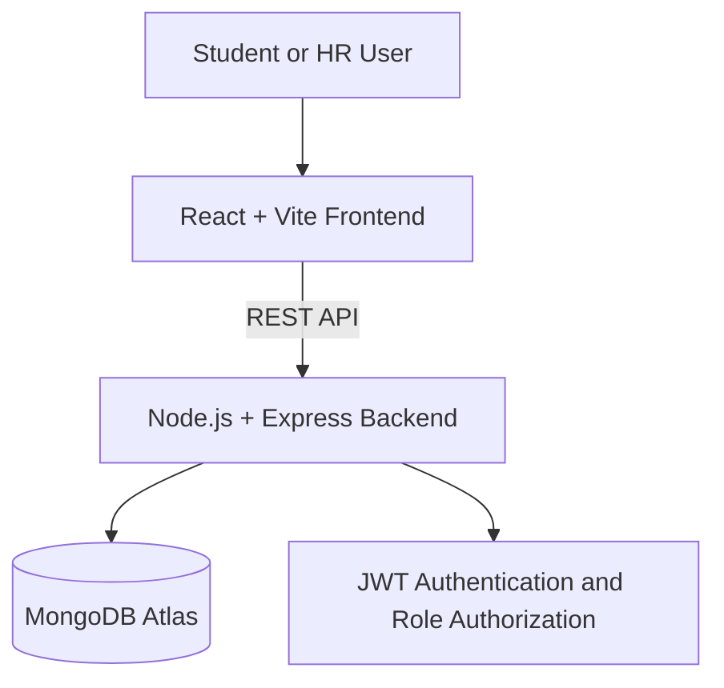

# CareerBridge

CareerBridge is a full-stack recruitment platform that connects students with HR professionals. Students can build professional profiles, discover jobs, submit applications with cover letters and track their status. HR professionals can post jobs, review candidates and manage applications.

## Live Application

- **Website:** [https://careerbridge-7g27.onrender.com](https://careerbridge-7g27.onrender.com)
- **API Health Check:** [https://careerbridge-7g27.onrender.com/api](https://careerbridge-7g27.onrender.com/api)

> The free Render service may take around one minute to start after a period of inactivity.

## Key Features

### Student Features

- Create a secure student account
- Build and update a professional profile
- Add education, skills, location and professional links
- Search jobs by title, company, location or skill
- Filter opportunities by job type
- Apply with a customized cover letter
- Prevent duplicate job applications
- Track pending, shortlisted and rejected applications
- View profile-completion and application statistics

### HR Features

- Create a dedicated HR account and company profile
- Post new job opportunities
- View and manage posted jobs
- Review applicants and their cover letters
- Open detailed student profiles
- Shortlist or reject applications
- View recruitment statistics on the HR dashboard

### Platform Features

- JWT-based authentication
- Role-based authorization for students and HR
- Secure password hashing with bcrypt
- Responsive React interface
- REST API built with Express
- MongoDB Atlas cloud database
- Same-origin production deployment
- Automated deployment from GitHub through Render

## Technology Stack

| Layer | Technologies |
|---|---|
| Frontend | React 19, React Router, Vite 8, CSS |
| Backend | Node.js, Express 5 |
| Database | MongoDB Atlas, Mongoose |
| Authentication | JSON Web Tokens, bcryptjs |
| Deployment | Render |
| Version Control | Git and GitHub |

## Architecture



## Main Workflows

### Student Workflow

1. Register or log in as a student.
2. Complete the student profile.
3. Browse and filter available jobs.
4. Apply with a cover letter.
5. Track the application status from the dashboard.

### HR Workflow

1. Register or log in as an HR professional.
2. Complete the HR/company profile.
3. Create and publish job opportunities.
4. Review applications and candidate profiles.
5. Shortlist or reject candidates.

## Project Structure

```text
CareerBridge/
├── backend/
│   ├── config/
│   ├── controllers/
│   ├── middleware/
│   ├── models/
│   ├── routes/
│   ├── server.js
│   └── package.json
├── frontend/
│   ├── src/
│   │   ├── pages/
│   │   ├── App.jsx
│   │   └── main.jsx
│   ├── vite.config.js
│   └── package.json
└── README.md
```

## Getting Started Locally

### Prerequisites

- Node.js 22 or later
- npm
- MongoDB Atlas account
- Git

### 1. Clone the Repository

```bash
git clone https://github.com/sanjaykadiyala/CareerBridge.git
cd CareerBridge
```

### 2. Install Dependencies

```bash
npm install --prefix backend
npm install --prefix frontend
```

### 3. Configure Environment Variables

Create `backend/.env`:

```env
MONGO_URI=your_mongodb_atlas_connection_string
JWT_SECRET=your_secure_random_secret
PORT=5000
```

Never commit the `.env` file or expose its values publicly.

### 4. Start the Backend

```bash
npm run dev --prefix backend
```

### 5. Start the Frontend

Open another terminal:

```bash
npm run dev --prefix frontend
```

Open [http://localhost:5173](http://localhost:5173) in your browser.

If PowerShell blocks `npm.ps1`, use `npm.cmd` instead of `npm`.

## API Overview

| Method | Endpoint | Access | Purpose |
|---|---|---|---|
| POST | `/api/auth/register` | Public | Create an account |
| POST | `/api/auth/login` | Public | Log in |
| GET | `/api/jobs` | Authenticated | View available jobs |
| POST | `/api/jobs` | HR | Post a job |
| GET | `/api/jobs/mine` | HR | View posted jobs |
| POST | `/api/applications/:jobId` | Student | Apply for a job |
| GET | `/api/applications/mine` | Student | View applications |
| GET | `/api/applications/job/:jobId` | HR | View job applicants |
| PATCH | `/api/applications/:id/status` | HR | Update application status |
| GET/PUT | `/api/student-profiles/me` | Student | Manage student profile |
| GET/PUT | `/api/hr-profiles/me` | HR | Manage HR profile |
| GET | `/api/dashboard/student` | Student | View student statistics |
| GET | `/api/dashboard/hr` | HR | View HR statistics |

## Security

- Passwords are hashed before storage.
- JWT tokens protect authenticated routes.
- Role middleware separates student and HR permissions.
- Database credentials and JWT secrets are stored in environment variables.
- Secret files and dependencies are excluded through `.gitignore`.

## Deployment

CareerBridge is deployed as a single Render web service:

1. Vite creates the optimized frontend production build.
2. Express serves both the React application and REST API.
3. MongoDB Atlas provides persistent cloud storage.
4. Render automatically redeploys changes merged into the `main` branch.

## Future Enhancements

- Direct resume and profile-picture uploads
- Email notifications for application-status changes
- Advanced job recommendations
- Pagination and additional search filters
- Admin moderation dashboard
- Automated backend and frontend testing

## Author

**Sanjay Kadiyala**

- GitHub: [@sanjaykadiyala](https://github.com/sanjaykadiyala)
- Project repository: [CareerBridge](https://github.com/sanjaykadiyala/CareerBridge)